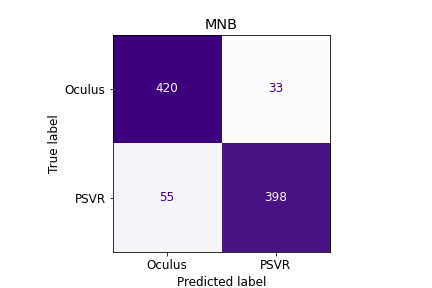

# VR Subreddit NLP Project
Jen Zieger

## Contents:
- [Overview](#Overview)
- [Scenario & Problem Statement](#Scenario-&-Problem-Statement)
- [Strategy](#Strategy)
- [Evaluation](#Evaluation)
- [Conclusions](#Conclusions)
- [Recommendations](#Recommendations)

## Overview
According to Merriam-Webster Dictionary, virtual reality, also known as VR, is an artificial environment which is experienced through sensory stimuli (such as sights and sounds) provided by a computer and in which one's actions partially determine what happens in the environment [[1]](https://www.merriam-webster.com/dictionary/virtual%20reality). Reddit is a network of millions of people who are connected through thousands of communities where they can connect by sharing their interests, hobbies, and passions [[2]](https://www.redditinc.com/).

## Scenario & Problem Statement
Reddit is planning to deploy an improved model for predicting what video game-related subreddit a submission comes from. I've been contracted by Reddit to work on this project with a focus on virtual reality and build a model that accurately predicts whether a submission came from the subreddit [`r/PSVR`](https://www.reddit.com/r/PSVR/) or [`r/oculus`](https://www.reddit.com/r/oculus/).

## Strategy
**Data Collection**  
Using [Pushshift's](https://github.com/pushshift/api) API, I collected over 1500 submissions from the /r/PSVR and /r/oculus subreddits, totaling 3000+ submissions. The date range of the collection was from May 19th, 2021 to Oct 4th, 2021.
 
 
To view my data collection process, please go to the VR Subreddit Data Collection notebook.

**Data Dictionary**

|Feature|Type|Description|
|---|---|---|
|**created_utc** | int | Coordinated Universal Time the submission was made|
|**num_comments**|int|Number of comments the submission had|
|**selftext**|object| Text of the submission|
|**subreddit**|int|The subreddit identification. 1 = Oculus and 0 = PSVR|
|**word_count**|int|Count of words in the submission|
|**char_length**|int|Character length of the submission|
|**time**|int|Hour of the day the post was made|
|**date**|datetime|Date the post was made|

**Data Cleaning and EDA**  
Through data cleaning methods, I ensured there are no duplicate submissions and that there are unique post ids for each document. I also checked datatypes, outliers, dropping unnecessary rows/columns, and use feature engineering when needed.
 
 
My exploratory data analysis included:
- Distribution Plots
- Correlation Matrix
- Summary Statistics
- Additional Analysis as Needed

**Pre-Processing and Modeling**  
I developed the following models for testing:
- Baseline
- Multinomial Naive Bayes
- Random Forest
- Support Vector Machine
- Logistic Regression

The following methods were used to develop these models:
- Term Frequency — Inverse Document Frequency (TF-IDF)
- Count Vectorizer
- GridSearch
- Pipeline

## Evaluation  
Since we were not biased against False Negatives compared to False Positives, the F1 score was the score that was the final determinant to which model to go with. The MNB model had the best accuracy score, Recall Rate, Misclassification Rate, and F1 Score compared to the other models tested.

MNB Metric Evaluation:
- Accuracy: 0.902
    * This is the rate of submissions I correctly predicted
- Misclassification: 0.097
    * This is the rate of submissions I incorrectly predicted
- Specificity: 0.924
    * Among all of the submissions, I predicted the correct subreddit at this rate.
- Recall: 0.878
    * Among the submissions that belong to the subreddit, Oculus, I predicted them correctly at this rate.
- Precision: 0.097
    * Among the submissions that belong to the subreddit, PSVR, I predicted them correctly at this rate.
- F1 Score: 0.900
    * Since we are not biased to PSVR or Oculus, this is the mean score of precision and recall.

## Conclusions  
After fitting a plethora of models, it turns out my best model was my first model, Multinomial Naive Bayes. With an accuracy rate of 90.2% , this model performed 40.2% better than the baseline model.

A Multinomial Naive Bayes model with Count Vectorization and the following parameters should be used for predicting whether a submission comes from the r/oculus or r/PSVR subreddit:
- max_df: 0.3
- max_features: 5000
- ngram_range: (1,1)
- stop_words: english + 150 of the most common words

However, this model still needs some improvement as about 9% of the submissions were being misclassified.

## Recommendations  

While this is a great model, I think it could use some improvement before deploying it across the video game prediction algorithms.
 
My recommendations include:
- Since the Oculus subreddit was misclassified at a higher rate than the PSVR subreddit, I recommend optimizing for recall.
- Focus on Feature Engineering
    * Try other text processing methods
    * Try adding additional features like title and/or UTC
- Test other models and parameters
- Test on different types of video game subreddits

After a little more fine-tuning, I believe this will be a successful model to be used across the division.
